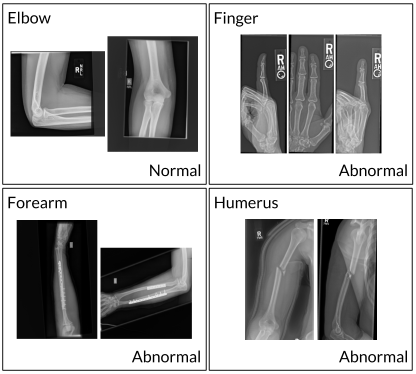
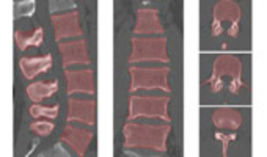

# Tutorial: Deep Learning in Medical Imaging 

- **Data Pipelining**
- **Classifiacation (MURA v1.0)**
- **Segmentation (Lumbar vertebra segmentation CT image database)**


## Install Requirements

```
pip3 install -r requirements.txt
```

## Open Datasets (License Required)

- MURA Dataset (v-1.0) for Classification
---



[MURA] (https://stanfordmlgroup.github.io/competitions/mura/)

[Journal] (https://arxiv.org/abs/1712.06957)

---
- Lumbar vertebra segmentation CT image database



[SpineWeb Dataset 5] (http://spineweb.digitalimaginggroup.ca/spineweb/index.php?n=Main.Datasets#Dataset_7.3A_Intervertebral_Disc_Localization_and_Segmentation.3A_3D_T2-weighted_Turbo_Spin_Echo_MR_image_Database)


## License

This project is licensed under the MIT License - see the [LICENSE.md](LICENSE.md) file for details

## Contact

dhlee@melab.snu.ac.kr

